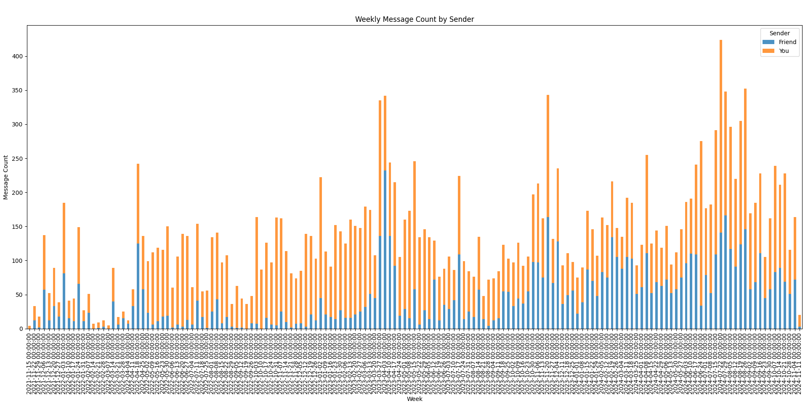

# Project Proposal: Analysis of Instagram Message Data - Abdullah Ahmad DSA 210

## **Objective:**
The goal of this project is to analyze my Instagram usage, specifically the messages exchanged with a particular friend over time. The data for this analysis is obtained from Instagram's data export feature, which provides message records in HTML format. I aim to parse this data, conduct a hypothesis test, and visualize the findings to determine whether I send more messages than my friend.

---

## **Methodology:**

### 1. **Data Collection:**
- The raw message data is exported from Instagram in HTML format via Instagram's data request feature.
- Using Python's **BeautifulSoup** library, the HTML data is parsed to extract relevant details such as the sender, message content, and timestamp.

### 2. **Data Parsing:**
- After extracting the necessary data, I save it in CSV format for easier processing and further analysis. 
- **Pandas** is used to create and manipulate DataFrames, which allows for efficient data cleaning, organization, and aggregation.

### 3. **Data Analysis:**
- The parsed data is loaded into Pandas DataFrames for analysis.
- I first separate messages sent by me (Abdullah Ahmad) and my friend (Muhammad Faizan) into distinct datasets.
- Using **Scipy's t-test** (specifically `ttest_ind`), I test the hypothesis that I send more messages than my friend. The test is conducted based on daily or weekly message counts.

### 4. **Hypothesis:**
- **Null Hypothesis (H₀):** I and my friend send an equal proportion of messages.
- **Alternative Hypothesis (H₁):** I send more messages than my friend.

### 5. **Statistical Tests:**
- The **t-test** is used to determine if there is a significant difference between the number of messages I send and the number my friend sends. The alternative hypothesis is set to check if I send more messages.
- The results of the t-test, including the T-statistic and P-value, are used to decide whether to reject or fail to reject the null hypothesis.

### 6. **Visualization:**
- A bar chart is created to visualize the daily or weekly message counts for both me and my friend. This helps to provide a clear, visual representation of the message frequency over time.
- **Matplotlib** is used for plotting the data, and I aggregate the data by week (instead of daily counts) to provide a clearer overview.

---

## **Libraries and Tools Used:**
- **BeautifulSoup**: To parse the HTML data obtained from Instagram.
- **Pandas**: For data manipulation and cleaning, including converting the parsed data into DataFrames and performing aggregations.
- **Scipy**: For conducting statistical tests such as the t-test to validate the hypothesis.
- **Matplotlib**: For visualizing the message data, specifically creating bar charts for daily or weekly counts.

---

## **Results:**
- Total Messages Sent by You: 18,845
- Total Messages Sent by Your Friend: 13,730
- T-statistic: 13.048
- P-value: 8.91e-38
- Since the P-value is extremely small, we reject the null hypothesis, meaning that I do indeed send more messages than my friend.

## **Conclusion:**
- Based on the results of the t-test and the visualizations, the hypothesis that I send more messages than my friend is supported by the data. The statistical evidence shows that I have sent significantly more messages overall and on a weekly basis. This analysis --   demonstrates how Instagram message data can be used to analyze personal communication patterns.

- 

The chart above visualizes the number of messages exchanged on a weekly basis.
