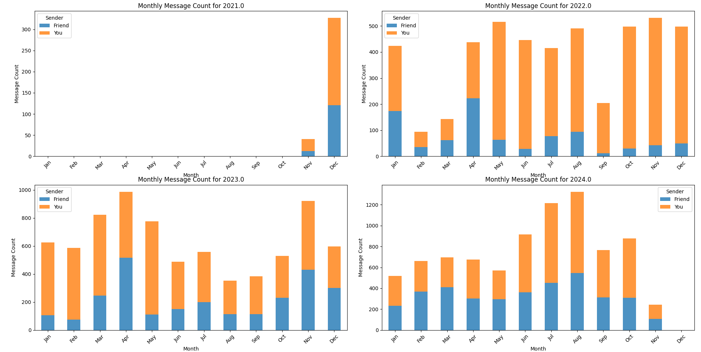
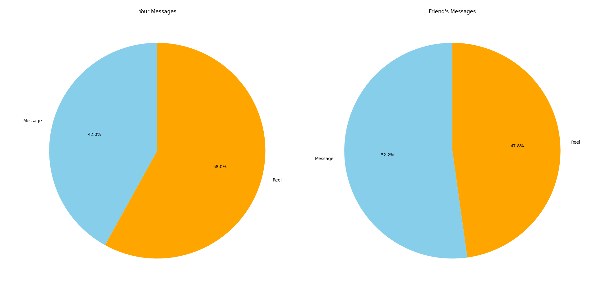
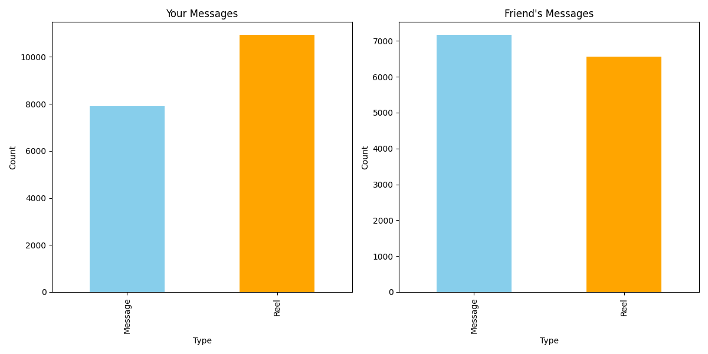
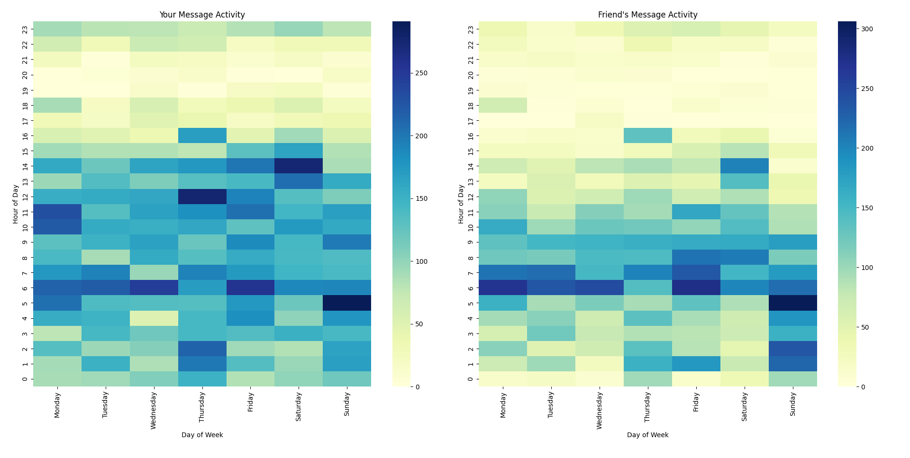
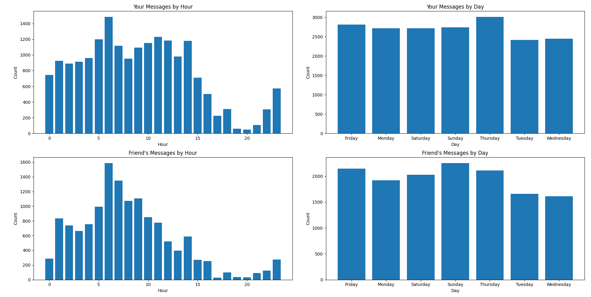
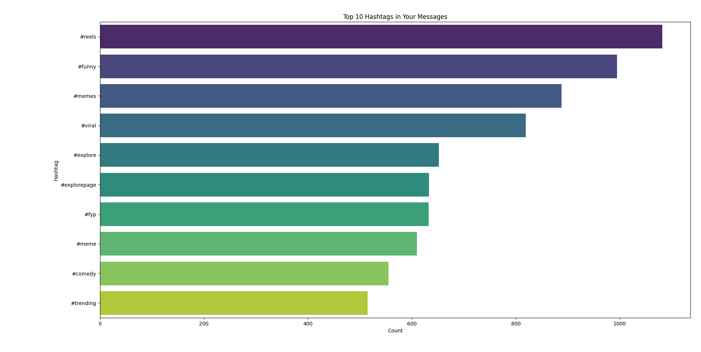
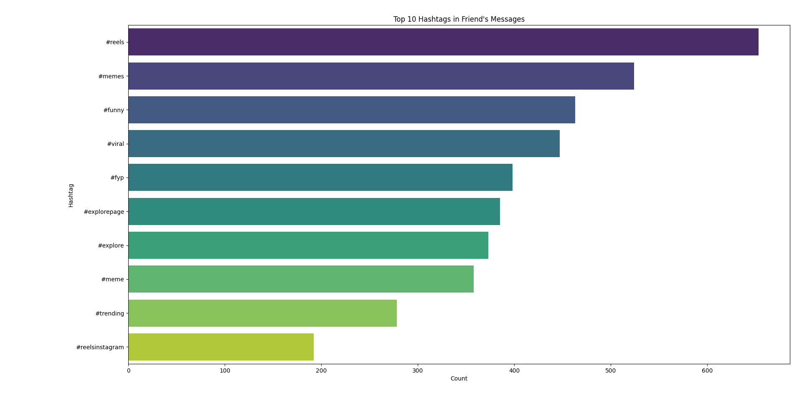
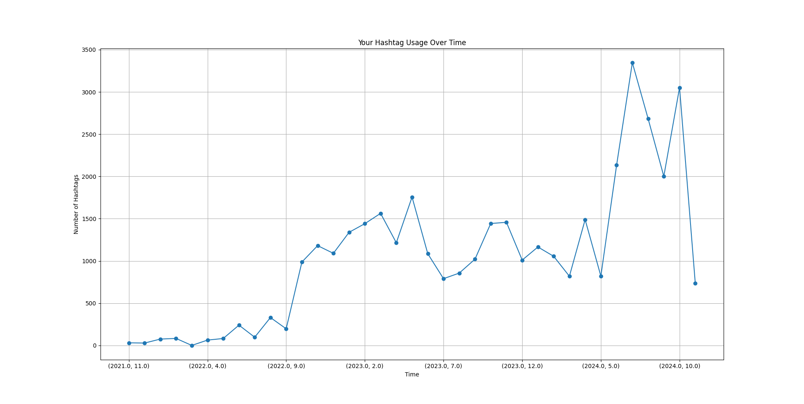
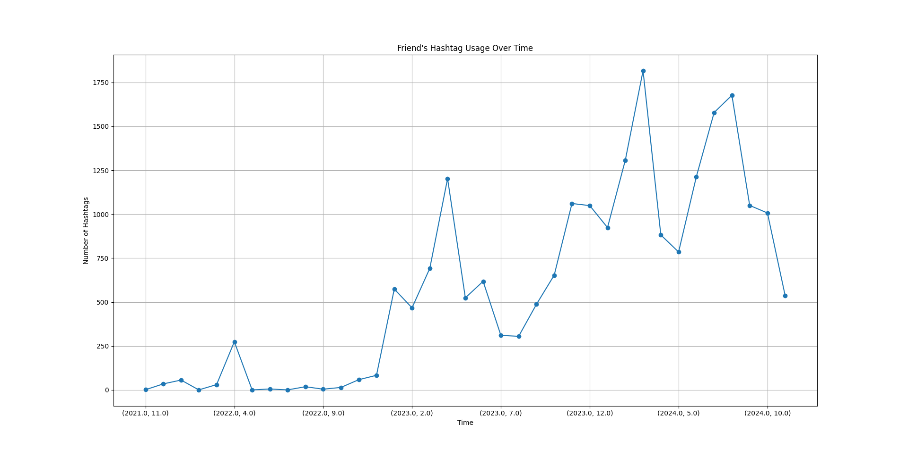

# Project Proposal: Analysis of Instagram Message Data - Abdullah Ahmad DSA 210

## **Objective:**
The goal of this project is to analyze my Instagram usage, specifically the messages exchanged with a particular friend over time. The data for this analysis is obtained from Instagram's data export feature, which provides message records in HTML format. I aim to parse this data, conduct several hypothesis tests, and visualize the findings to determine trends, patterns, and differences in message activity.

## **NOTE:**
The images in the readme can be expanded by clicking on them

---

## **Methodology:**

## 1. **Data Collection:**
- The raw message data is exported from Instagram in HTML format via Instagram's data request feature.
- Using Python's **BeautifulSoup** library, the HTML data is parsed to extract relevant details such as the sender, message content, and timestamp.

## 2. **Data Parsing:**
- After extracting the necessary data, I save it in CSV format for easier processing and further analysis. 
- **Pandas** is used to create and manipulate DataFrames, which allows for efficient data cleaning, organization, and aggregation.

## 3. **Data Analysis:**
- The parsed data is loaded into Pandas DataFrames for analysis.
- I first separate messages sent by me (Abdullah Ahmad) and my friend into distinct datasets.
- Using statistical tests, we compare the overall number of messages sent, reel-sharing behavior, and hashtag trends.

## 4. **Hypotheses:**
1. Overall Message Activity
   - **Null Hypothesis (H₀):** I and my friend send an equal proportion of messages.
   - **Alternative Hypothesis (H₁):** I send more messages than my friend.
2. Reel-Sharing Activity
   - **Null Hypothesis (H₀):** There is no difference in reel-sharing activity between weekdays and weekends.
   - **Alternative Hypothesis (H₁):** Reel-sharing activity differs significantly between weekdays and weekends.
3. Reel Activity by Day Type
   - **Null Hypothesis (H₀):** There is no significant difference in mine or my friend's reel-sharing activity between weekdays and weekends
   - **Alternative Hypothesis (H₁):** There is a significant difference in my mine or my friend's reel-sharing activity between weekdays and weekends.

## 5. **Statistical Tests:**
- The **t-test** and **z-test** are used to determine the results of the hypothesese above. 
- The results of the tests, including the T and Z statistics and P-values, are used to decide whether to reject or fail to reject the null hypotheses for the above claims.

## 6. **Visualization:**
### **Monthly Message Count Bar Charts**

- Purpose: Displays the monthly message counts for each year, categorized by sender.
- Visualization Method: Stacked bar charts, plotted for each year using matplotlib.

### **Heatmaps of Message Activity**

- Purpose: Visualizes the distribution of message activity across days of the week and hours of the day for both users.
- Visualization Method: Heatmaps created using seaborn.

### **Pie Charts of Message and Reel Proportions**

- Purpose: Shows the proportion of regular messages versus reels for each sender.
- Visualization Method: Pie charts, plotted separately for each sender using matplotlib.

### **Bar Charts for Message and Reel Counts**

- Purpose: Provides a breakdown of the counts for regular messages and reels for each sender.
- Visualization Method: Side-by-side bar charts using matplotlib.

### **Hourly and Daily Message Counts**

- Purpose: Displays the frequency of messages sent by hour of the day and by day of the week.
- Visualization Method: Bar charts using matplotlib.

### **T-Distribution vs Normal Distribution Plot**

- Purpose: Compares the t-distribution to a normal distribution for hypothesis testing results.
- Visualization Method: Line plots of distributions, with t-statistic markers using matplotlib.

### **Top Hashtags Bar Charts**

- Purpose: Highlights the top 10 hashtags used by each sender.
- Visualization Method: Horizontal bar charts created using seaborn.

### **Hashtag Usage Over Time**

- Purpose: Shows trends in hashtag usage over time (grouped by month and year).
- Visualization Method: Line charts with markers using matplotlib.
---

## **Libraries and Tools Used:**

- File parsing: BeautifulSoup, pandas
- Data Handling: pandas, numpy
- Statistical Analysis: scipy.stats, statsmodels.stats.proportion
- Visualization: matplotlib, seaborn
- File Handling: glob
- String Analysis: re, collections.Counter
- Sentiment Analysis: textblob

---

## **Results:**
### General Message Statistics
- Total Messages Sent by me: 18,845
- Total Messages Sent by Your Friend: 13,730

- **T-Test Results:**
- T-Statistic: 7.64
- P-Value: 1.68e-14
- Conclusion: Reject the null hypothesis. I send more messages than my friend.

- ** This conclusion is evident in the 4 bar charts below highlighting the counts of messages sent by my friend and I from 2021-2024. Every bar shows that I send more messages to my friend instead of the other way around.

- 

- **But then the question arises. I send a lot of reels and a lot of messages on instagram to my friend. Is there a difference in the results if I only look at the reels? First we need to look at the proportion and count for reels.**

### Reel vs. Message Proportions

| Sender        | Message Count | Reel Count    | Reel Proportion |
| ------------- | ------------- | ------------- | --------------- |
| Me            | 7,910         | 10,935        | 58.03%          |
| Friend        | 7,168         | 6,562         | 47.79%          |

- The proportions between the messages and reels can also be viewed using the pie chart and bar graph below

- 
- 

- A Z-test hypothesis was conducted to see whether or not I sent more reels.
- ** Z-Test Results: **
- Z-Statistic: 18.29
- P-Value: 0.000
- Conclusion: Reject the null hypothesis. I send significantly more reels than my friend.

- **Does this reel sharing have a pattern? Is there a considerable difference in the amount of reels one of us sends if it is a weekday or weekend?

### Reel Sharing by Day Type

| Day Type        | 	My Reels | 	Friend's Reels   |
| ------------- | ------------- | ------------- |
| Weekday | 7,768 | 4,378 |
| Weekend | 3,167 | 2,184 |

- A T-Test Hypothesis was conducted to see whether or not there was a significant difference in reel sharing activity between weekdays and weekends.
- ** T-Test Results: **
- My Reel sharing:
  - T-stat: -0.54
  - P-value: 0.59
  - Conclusion: No significant difference in your reel-sharing activity between weekdays and weekends.
   
- Friend's Reel Sharing:
  - T-stat: -3.26
  - P-value: 0.0012
  - Conclusion: Significant difference in your friend's reel-sharing activity between weekdays and weekends.
 
- To verify these results, I made 2 different plots. One is a heatmap to see message count based on the time of day and the actual day itself. Another was gridspec with 4 different bar graphs. 2 of them were for the message count based on the time and the other 2 were for the message count based on the day.

- 
- 

- These visuals confirm my finding above as the heatmap shows that my friend sends more messages on the weekends as compared to on the weekdays whereas my count is more spread out with the day not defining my message count.
  
- These charts also reveal an interesting finding with regards to the time of day where messages were sent. Most of the messages were sent late in the night or early in the day with very few messages sent during the evening. One possibility for this reduction during the evening could be due to the fact that people spend time with their families during the evening and therefore do not send as many messages.
- Overall, the graph reflects distinct communication habits and shared preferences for late-night messaging, but with slight variations in evening activity

### Top Hashtags
- Something else I wanted to test was the similarity in the content that we shared.
- One way to to do this was by checking the hashtags present in each reel.
- The top 10 hashtags were extracted for each person and compared.

** My top hashtags
  
| Hashtag  | Count |
| ------------- | ------------- |
| #reels  | 1,082  |
| #funny  | 995 |
| #memes  | 888  |
| #viral  | 819  |
| #explore  | 652 |
| #explorepage  | 633 |
| #fyp | 632 |
| #meme  | 610 |
| #comedy  | 555  |
| #trending  | 515 |

** Friend's top hashtags
  
| Hashtag  | Count |
| ------------- | ------------- |
| #reels  | 653  |
| #memes  | 524  |
| #funny  | 463 |
| #viral  | 447  |
| #fyp | 398 |
| #explorepage  | 385 |
| #explore  | 373 |
| #meme  | 358 |
| #trending  | 281 |
| #reelsinstagram  | 194 |

- Apart from these, All reels sent had 5,161 common hashtags.
- The hashtag analysis highlights common themes in our shared content, with humor and trending topics dominating. This was expected as we share reels that one found "funny" or "humorous".
- The table above can be visualized below through the bar plots

- 
- 

- Furthermore, to see how often reels with similar content or hashtags were sent, line charts were created to represent the trend of hashtag presence in the sent reels.

- 
- 

- Can these hashtags be used to understand the sentiment of the reesl? To do this ```textblob``` was used to perform a sentiment on the hashtags.
- Average Sentiment of Messages Containing Hashtags:
- My Messages: 0.14
- Friend's Messages: 0.13
- The low score suggests that the hashtags do not give any meaningful information about the average sentiment of the messages exchanged.
  
## **Conclusion:**
The analysis of Instagram message data between me and my friend provided intriguing insights into our messaging habits, reel-sharing behavior, and content trends. Below are the key takeaways from this study:

**Overall Messaging Trends:**

- I sent significantly more messages than my friend over the analyzed period, as confirmed by statistical tests and visualizations.
The difference in messaging behavior between us is consistent across all years analyzed.

**Reel-Sharing Patterns:**

- Reel-sharing constitutes a significant portion of our messages, with reels accounting for over 58% of my sent messages compared to 47% of my friend's.
I send significantly more reels than my friend, as demonstrated by the Z-test results.
While my reel-sharing activity does not significantly vary between weekdays and weekends, my friend shares noticeably more reels on weekends.

**Timing of Message Activity:**

- Both of us exhibit late-night messaging patterns, with a drop in activity during the evening hours, likely due to shared personal routines.
- The heatmap and bar charts show that my friend's activity peaks on weekends, whereas mine is more evenly distributed throughout the week.

**Hashtag Usage and Content Trends:**

- The hashtag analysis reveals a strong overlap in the type of content we share, with humor, trending topics, and viral reels dominating.
- The most frequently used hashtags (#reels, #funny, #memes, #viral) indicate our shared interest in humorous and engaging content.
- The sentiment analysis of hashtags suggests that while they provide insights into the type of content shared, they are not sufficient for determining the overall emotional tone of the reels exchanged.
- Shared Content Similarities:

- The presence of 5,161 common hashtags emphasizes the shared nature of the content we exchange, reflecting similar tastes and interests.

While I am more active in sending messages and reels, our shared themes and interests are evident in the overlap of hashtags and late-night activity patterns. These findings not only highlight the depth of our online interactions but also provide a foundation for further exploration, such as analyzing sentiment, exploring temporal patterns over longer durations, or even incorporating multimedia content analysis.

Overall, this project demonstrates the power of leveraging personal data for meaningful insights and opens doors to exciting opportunities for similar analyses in other contexts.
